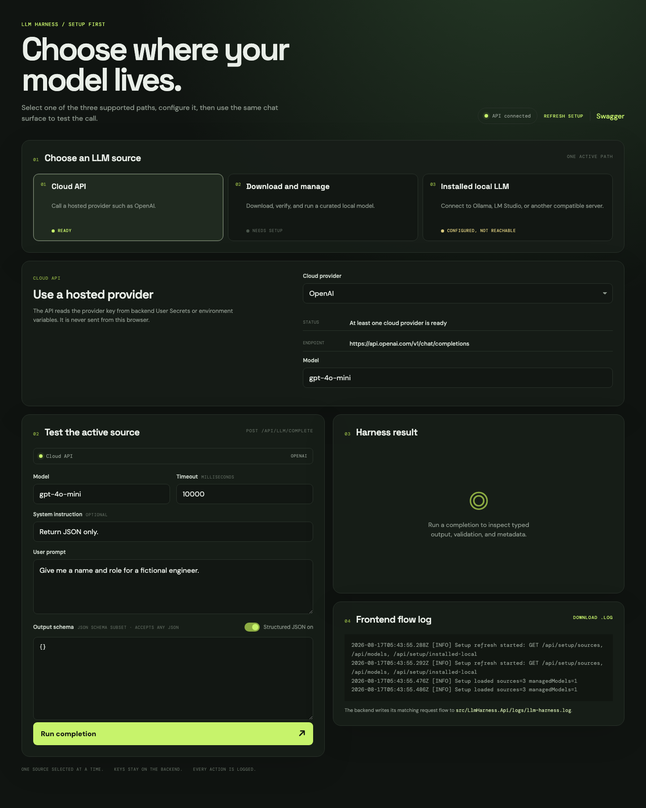
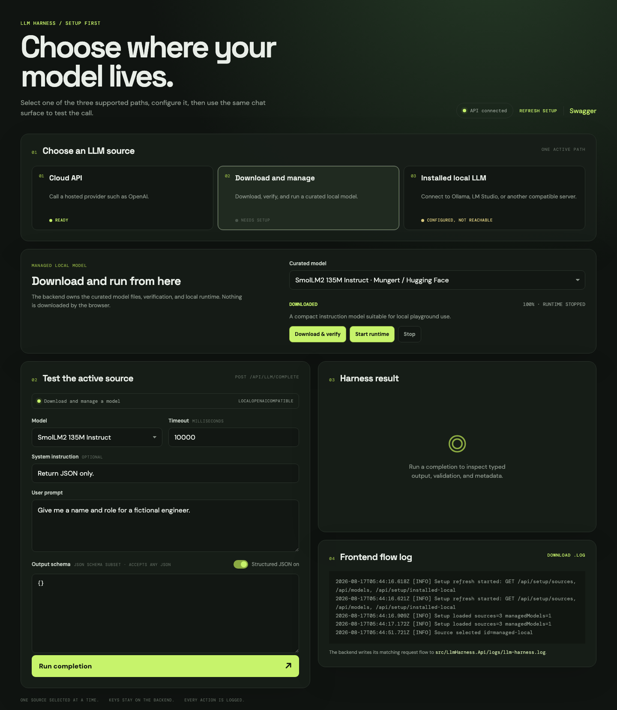
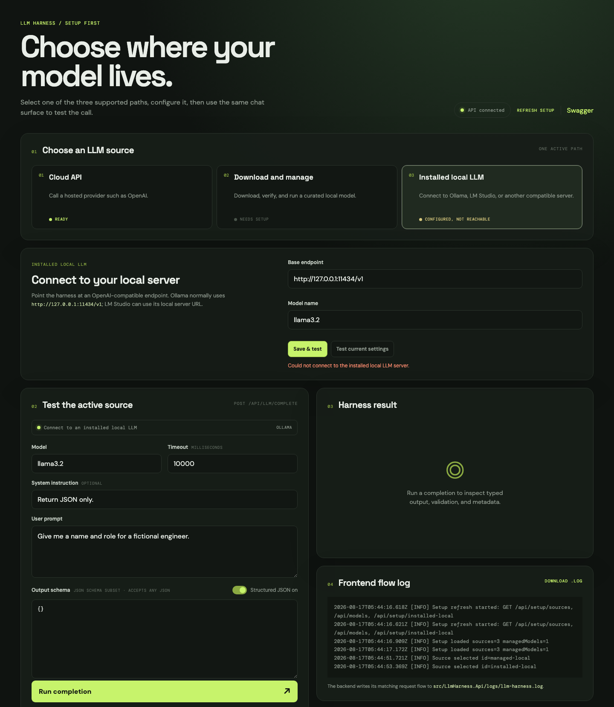

# Small Reusable LLM Harness

This repository contains a backend-first .NET 9 implementation of a small,
provider-agnostic LLM harness. It solves the repeated application problem of
calling different LLM providers with consistent validation, retries, timeouts,
fallbacks, typed output, and structured errors. Application code depends on
contracts in `LlmHarness.Core`; provider adapters and the demo API remain
separate projects.

## Current scope

The project includes the core MVP, a minimal API demo, and an optional managed
local-model extension. Phase 10 adds centralized provider selection:

- `ILlmHarness` for application-facing execution.
- `ILlmProvider` for provider adapters.
- Provider-independent request, response, result, error, and metadata models.
- Provider, execution-mode, message-role, and error-type enums.
- `ILlmRequestValidator` and `LlmRequestValidator` for fail-fast validation.
- `ValidatingLlmHarness`, which rejects invalid requests before delegating to
  the provider-facing harness.
- Structured, non-retryable `InputValidationError` results.
- `ISchemaValidator` and `JsonSchemaValidator` for common JSON Schema rules.
- `SchemaValidatingLlmHarness`, which validates successful JSON output before
  returning it to callers.
- Structured responses accept any JSON root (object, array, string, number,
  boolean, or null), including JSON wrapped in Markdown fences or short model
  explanations. Responses with no JSON value return a non-retryable
  `OutputParsingError`.
- `LlmRetryPolicy` and `RetryingLlmHarness` for transient provider failures.
- Retry configuration with 3 retries, 500 ms initial delay, 5 s maximum delay,
  and optional jitter by default.
- Attempt and retry counts in `LlmMetadata`.
- `LlmTimeoutOptions` for configurable default timeouts.
- `TimeoutLlmHarness` for linked-token cancellation and structured timeout
  failures.
- Optional one-attempt fallback harness support.
- Duration, timeout, fallback, and selected-provider metadata.
- `LlmHarness` for provider selection, validation, retries, timeout/fallback,
  output validation, and correlation-aware flow/response diagnostics.
- `OpenAiProvider` using `IHttpClientFactory` or an injected `HttpClient`.
- `OpenAiOptions` with `OPENAI_API_KEY` environment-variable support.
- OpenAI request/response mapping and normalized provider exceptions.
- `GoogleGeminiProvider` with `generateContent` request mapping, structured
  JSON response mode, `Google-LLM:ApiKey` User Secrets support, and normalized
  provider errors.
- `IProviderSelector` and `ProviderSelector` for manual, cloud-preferred, and
  local-preferred selection.
- `ProviderSelectionOptions` with `AutoPreferCloud` as the default mode.
- A minimal API host with `GET /health`, `GET /api/providers/status`, and
  `POST /api/llm/complete`.
- API request mapping, malformed-request validation, structured result mapping,
  and secret-safe provider status reporting.
- Optional managed-model catalog, checksum-verified downloads, runtime startup,
  local OpenAI-compatible provider, and model-management endpoints.
- Optional React + Vite playground for composing requests and inspecting
  results without exposing provider credentials.
- Contract, input validation, schema validation, retry, timeout, fallback,
  provider-selection, orchestration, and API smoke tests.

The managed local-model extension is explicitly optional and does not change the
core harness contracts. A standard externally managed local provider remains a
separate integration choice.

## Showcase: a browser-local harness provider

The assessment target is the small reusable backend harness. Its core story is
provider-agnostic reliability: validation, retry, timeout, fallback, logging,
redaction, and structured results around an LLM call.

As a showcase extension, the same harness-oriented flow can also run an LLM
entirely in the browser through WebLLM and WebGPU. This explores the question:
what if the harness did not need a cloud API or a backend inference server at
all? It demonstrates that the abstraction can support cloud APIs, backend-local
runtimes, and browser-local inference without moving credentials into the
frontend or changing the request-oriented UI.

Browser WebLLM is intentionally an optional demo provider, not the core MVP or
the default production path. Browser inference has different tradeoffs,
including WebGPU compatibility, large model downloads, GPU memory limits,
slower cold starts, and device-dependent throughput. The frontend records
browser performance fields such as prompt/output size, configured token limit,
temperature, schema mode, cold-start state, cache state, model tier, timeout,
and WebLLM decode tokens/second when available.
The built-in schema validator supports `type`, `required`,
`properties`, `items`, `additionalProperties`, `enum`, and `const`.

Retrying is limited to rate limits, 5xx responses, request timeouts, and
transient network failures. Client errors such as 400 and 401, validation
errors, and output schema errors are not retried.

When a request times out, the harness returns a structured `TimeoutError`. The
API can enable the core fallback path by naming another configured provider in
`LlmHarness:FallbackProvider` (or `LLM_HARNESS_FALLBACK_PROVIDER`). It is
attempted once after the timeout, only when that provider is available, and
`FallbackUsed` is set in the result metadata. Fallback is deliberately opt-in
so a timeout does not silently create a second billable provider call.

The orchestration logger receives correlation IDs and provider/model/result
metadata. The backend `.log` file can also include complete harness request and
response payloads to diagnose provider, schema, and parsing failures. Payloads
are redacted recursively for credential-shaped fields such as API keys,
authorization headers, bearer tokens, passwords, cookies, and client secrets.
Prompts and model responses can still contain sensitive business data, so this
diagnostic mode is intended for development. Disable payloads with
`LlmHarness:Logging:IncludePayloads=false` or
`LLM_HARNESS_LOG_PAYLOADS=false`.

The API writes request, completion, harness, and unexpected-error flow events to
`src/LlmHarness.Api/logs/llm-harness.log` when running from the repository. Set
`LLM_HARNESS_LOG_FILE` to choose another `.log` path. The frontend also shows a
live flow log and can download it with the `Download .log` button; it records
request stages and response metadata without logging prompts or credentials.

The playground exposes three distinct LLM source modes:

1. **Cloud API** — the API supports OpenAI, Google Gemini, Mistral, and Grok.
   Each provider reads its API key from backend User Secrets or its matching
   environment variable. Gemini uses the `generateContent` REST API; Mistral
   and Grok use OpenAI-compatible chat completions.
2. **Run in browser** — the React client loads curated WebLLM/MLC artifacts
   into browser storage and executes them with WebGPU. The catalog currently
   includes SmolLM2 135M, Qwen3 0.6B, DeepSeek-R1 Distill Qwen 7B, and Google
   Gemma 3 1B Instruct, plus Qwen Tiny 0.5B and Qwen Small 0.6B variants for
   lower-memory devices. Browser models are classified as lightweight,
   standard, heavy, or experimental, with recommended flags and GPU-memory
   guidance. Prompts and completions stay in the browser for this mode; the API
   only supplies catalog metadata.
3. **Installed local LLM** — configure an existing Ollama, LM Studio, or other
   OpenAI-compatible server in the UI. The API also accepts
   `LLM_HARNESS_INSTALLED_LOCAL_ENDPOINT`, `LLM_HARNESS_INSTALLED_LOCAL_MODEL`,
   and optional `LLM_HARNESS_INSTALLED_LOCAL_API_KEY` environment variables.

Missing cloud keys or unavailable local runtimes are reported as structured
provider status; they do not prevent the API from starting. Provider error
messages redact configured keys before they become exceptions or harness
results.

## Frontend behavior

The React playground is organized around one active source at a time. The user
first selects Cloud API, Run in browser, or Installed local LLM. The page
then shows only the setup controls relevant to that source and reuses one
shared completion form for the actual request.

Cloud API supports OpenAI, Google Gemini, Mistral, and Grok. The frontend
displays provider availability but never receives or displays the actual API key. User Secrets
are loaded by the backend into dependency-injected provider options. If a key
is missing, the page reports that the provider needs setup; the key must be
configured in the backend rather than placed in browser code.

The page also provides source readiness cards, managed-model lifecycle
controls, installed-local endpoint/model testing, structured JSON schema input,
result metadata, structured errors, Swagger navigation, and a downloadable
frontend `.log` flow trace. See
[`frontend/llm-harness-web/README.md`](frontend/llm-harness-web/README.md) for
the complete frontend workflow and endpoint list.

The playground also offers optional advisory input-schema validation. Users can
define a flexible schema in a dialog and turn it on or off; mismatches are
shown in the page and frontend log but never prevent the request from reaching
the selected LLM provider.

## Frontend screens and usage

The playground has one shared layout with a source-specific setup panel. Select
one source at a time. Cloud API and Installed local use the backend completion
route; browser WebLLM requests run directly inside the frontend Worker.

### Cloud API



Choose OpenAI, Google Gemini, Mistral, or Grok, then select the model. The API
key is loaded by the backend from User Secrets or environment variables; it is
never entered into or sent by the browser. Use the shared request form to set
the prompt, timeout, and optional schema. The default `{}` schema accepts any
valid JSON response.

### Run in browser



Choose SmolLM2, Qwen3, DeepSeek-R1 Distill Qwen, or Gemma 3, then use **Download
to browser** or **Start browser runtime**. WebLLM downloads MLC artifacts from
its curated model sources, caches them in browser storage, and runs inference
with WebGPU. The API is not called for the prompt or completion. While loading,
the page shows a styled toast with percentage and a progress bar. Gemma remains
subject to Google's Gemma terms of use.

### Installed local LLM



Enter the base URL and model name for an existing Ollama, LM Studio, or other
OpenAI-compatible server. **Save & test** stores the settings through the API
and checks connectivity. The browser still calls only the local API routes; the
backend calls the configured local server.

### Shared request, result, and logs

The request panel accepts the model, timeout, system instruction, user prompt,
and optional JSON schema. The result panel displays returned data, provider,
model, duration, attempts, timeout, fallback, and correlation metadata. For
browser-local completions it also shows prompt/output character counts,
generation settings, schema mode, cold-start/cache state, model tier, and
tokens/second when WebLLM reports it. The
frontend flow log records UI actions and HTTP outcomes and can be downloaded;
the backend writes the detailed flow and provider-response diagnostics to
`src/LlmHarness.Api/logs/llm-harness.log`.

## Project layout

```text
src/
  LlmHarness.Api/
  LlmHarness.Core/
  LlmHarness.ManagedModels/
  LlmHarness.Providers.OpenAI/
  LlmHarness.Providers.Local/
frontend/
  llm-harness-web/
tests/
  LlmHarness.Tests/
```

The core project has no reference to provider-specific projects or SDKs.

## Run locally

The shortest path to experiencing the project is to run the API and call it
with `curl`. You need the .NET 9 SDK, `curl`, and optionally `jq` for readable
JSON extraction.

### 1. Clone and enter the repository

```bash
git clone https://github.com/gmottajr/Reusable-LLM-Harness.git
cd Reusable-LLM-Harness
```

If you are working from an existing checkout, start from its root instead.

### 2. Restore, build, and test

```bash
dotnet restore
dotnet build
dotnet test
```

The tests are focused on the reliability behavior that matters most: input and
output validation, retries, non-retryable errors, timeouts, fallback,
provider selection, provider mapping, managed-model safety, orchestration, and
API behavior.

### 3. Configure OpenAI

For local development, this API has a `UserSecretsId`, so use the .NET Secret
Manager from the VS Code terminal. These values are stored outside the
repository and are not committed.

```bash
cd src/LlmHarness.Api
dotnet user-secrets set OPENAI_API_KEY 'your-api-key'
dotnet user-secrets set OPENAI_DEFAULT_MODEL 'gpt-4o-mini'
dotnet user-secrets set LLM_HARNESS_INSTALLED_LOCAL_API_KEY 'optional-local-server-key'
dotnet user-secrets list
```

Start the API with its Development launch profile so the secrets are loaded:

```bash
dotnet run --project src/LlmHarness.Api --urls http://localhost:5000
```

If you intentionally use `--no-launch-profile`, set the environment explicitly:

```bash
ASPNETCORE_ENVIRONMENT=Development dotnet run \
  --project src/LlmHarness.Api --no-launch-profile --urls http://localhost:5000
```

The API also accepts `OPENAI_API_KEY`, `OPENAI_ENDPOINT`, and
`OPENAI_DEFAULT_MODEL` as environment variables. An authenticated installed
local server can use the `LLM_HARNESS_INSTALLED_LOCAL_API_KEY` user secret or
environment variable. Environment variables are useful for containers and
deployment; user secrets are intended for local development only. User secrets
are not encrypted, so do not use them as a production secret store.

Optional cloud configuration:

```bash
dotnet user-secrets set 'OpenAI-API-settings:ApiKey' 'your-openai-key'
dotnet user-secrets set 'OpenAI-API-settings:Model' 'gpt-4o-mini'
dotnet user-secrets set 'OpenAI-API-settings:URL' 'https://api.openai.com/v1/chat/completions'
export OPENAI_ENDPOINT='https://api.openai.com/v1/chat/completions'
export OPENAI_DEFAULT_MODEL='gpt-4o-mini'
```

The API loads provider-specific option DTOs from configuration through
dependency injection. The nested User Secrets sections are the preferred
local format; matching environment variables remain supported for containers
and deployment environments.

Google Gemini can be configured with User Secrets:

```bash
dotnet user-secrets set 'Google-LLM:ApiKey' 'your-gemini-key'
dotnet user-secrets set 'Google-LLM:Model' 'gemini-flash-latest'
dotnet user-secrets set 'Google-LLM:URL' 'https://generativelanguage.googleapis.com/v1beta'
```

The frontend Cloud API setup panel lets you choose OpenAI, Google Gemini,
Mistral, or Grok. The browser sends only the provider/model selection; API keys
remain in the backend process.

To enable a timeout fallback during local development, choose a provider that
has a configured backend key:

```bash
dotnet user-secrets set 'LlmHarness:FallbackProvider' 'GoogleGemini'
```

The same setting can be supplied as `LLM_HARNESS_FALLBACK_PROVIDER` in a
container or deployment environment. Supported values are the registered
provider enum names, such as `OpenAi`, `GoogleGemini`, `Mistral`, and `Grok`.

The API can still start without a key. In that case OpenAI appears as
unavailable and requests that select it return a structured provider error.

### 4. Start the API

Use a fixed local URL so the `curl` examples and React playground use the same
address:

```bash
dotnet run --project src/LlmHarness.Api --urls http://localhost:5000
```

Keep this terminal running. Open a second terminal in the repository root for
the remaining steps.

### 5. Check that the API is alive

```bash
curl -sS http://localhost:5000/health
```

Expected result:

```json
{"status":"healthy"}
```

Check provider availability without exposing credentials:

```bash
curl -sS http://localhost:5000/api/providers/status | jq .
```

With `OPENAI_API_KEY` set, OpenAI should report `available: true`. Without it,
the response explains that the provider is unavailable but never returns the
key itself. The optional backend GGUF compatibility provider is unavailable
until its model has been downloaded and its runtime started. The normal
**Run in browser** path is checked by the frontend through WebGPU instead.

The source-oriented setup endpoints used by the playground are:

```text
GET  /api/setup/sources
GET  /api/setup/installed-local
PUT  /api/setup/installed-local
POST /api/setup/installed-local/test
```

For installed-local mode, use a base URL such as
`http://127.0.0.1:11434/v1` and a model already installed in that server. The
server must answer `/models` and `/chat/completions`.

### 6. Submit a structured completion

Create a request file:

```bash
cat > request.json <<'JSON'
{
  "provider": "OpenAI",
  "model": "gpt-4.1-mini",
  "timeoutMs": 10000,
  "messages": [
    {"role": "system", "content": "Return JSON only."},
    {"role": "user", "content": "Give me a fictional engineer name and role."}
  ],
  "outputSchema": {
    "type": "object",
    "required": ["name", "role"],
    "properties": {
      "name": {"type": "string"},
      "role": {"type": "string"}
    }
  }
}
JSON
```

Send it to the API:

```bash
curl -sS -X POST http://localhost:5000/api/llm/complete \
  -H 'Content-Type: application/json' \
  --data @request.json | jq .
```

The API maps this HTTP payload into the provider-independent `LlmRequest` and
passes it to `ILlmHarness`. The API does not call OpenAI directly.

### 7. Extract and understand the result

A successful response has this shape:

```json
{
  "success": true,
  "data": {"name": "Ada", "role": "Engineer"},
  "error": null,
  "metadata": {
    "provider": "OpenAI",
    "model": "gpt-4.1-mini",
    "attempts": 1,
    "retryCount": 0,
    "durationMs": 742.31,
    "timeoutMs": 10000,
    "fallbackUsed": false,
    "correlationId": "..."
  }
}
```

Save one response and inspect the pieces independently. Saving the response
also avoids sending the same paid request three times:

```bash
response=$(curl -sS -X POST http://localhost:5000/api/llm/complete \
  -H 'Content-Type: application/json' --data @request.json)

# The typed/structured model output
echo "$response" | jq '.data'

# Provider, timing, retry, and fallback behavior
echo "$response" | jq '.metadata'

# Failure details, when success is false
echo "$response" | jq '.error'
```

Important metadata fields:

- `provider` and `model` show what actually handled the request.
- `attempts` and `retryCount` show transient-failure recovery.
- `durationMs` and `timeoutMs` show execution timing and the applied limit.
- `fallbackUsed` shows whether the optional fallback path ran.
- `correlationId` identifies the request in safe operational logs.

The HTTP status also communicates the broad failure class: malformed input is
`400`, an unavailable provider is `503`, a timeout is `504`, and downstream
provider/output failures use a structured error envelope.

### 8. See validation fail before a provider call

Change the request to use an invalid role:

```bash
curl -sS -X POST http://localhost:5000/api/llm/complete \
  -H 'Content-Type: application/json' \
  -d '{"messages":[{"role":"not-a-role","content":"hello"}]}' | jq .
```

The response is HTTP `400` with `error.type` equal to
`InputValidationError`. This demonstrates the main safety boundary: invalid
requests are rejected before a provider is called.

## What this project is demonstrating

The main purpose is not to hide an SDK call behind another method. It is to
provide a small reliability and safety layer around LLM calls:

```text
application request
  -> input validation
  -> provider selection
  -> retry transient failures
  -> enforce timeout
  -> use optional fallback
  -> deserialize typed output
  -> validate output schema
  -> return structured result and safe metadata
```

To experience that flow, compare the same completion request across a
configured OpenAI provider and the optional managed local provider. The
application-facing contract stays the same while the provider, timing,
attempts, validation, and failure metadata remain visible in the response.

## Optional: use the React playground

With the API still running on port `5000`, open a third terminal:

```bash
cd frontend/llm-harness-web
npm install
npm run dev
```

Open `http://localhost:5173`. The Vite server proxies `/api` to the .NET API.
The page lets you choose a provider, enter a model and prompt, edit the output
schema, submit a request, inspect provider availability, and view result
metadata. It contains no API-key input; credentials remain in the backend
process.

## Optional: use the backend GGUF compatibility runtime

The normal frontend path is **Run in browser** and does not require
`llama-server`. The API still exposes an optional GGUF compatibility runtime
for deployments that explicitly need server-side local inference. To use that
legacy path, install a compatible `llama-server` executable and set its path:

```bash
export LLM_HARNESS_RUNTIME_EXECUTABLE=/path/to/llama-server
```

Start the API, list the curated catalog, download the supported model, and
start the runtime:

```bash
curl -sS http://localhost:5000/api/models | jq .
curl -sS -X POST \
  http://localhost:5000/api/models/smollm2-135m-instruct-q4km/download | jq .
curl -sS -X POST \
  http://localhost:5000/api/models/smollm2-135m-instruct-q4km/start | jq .
```

Then change `request.json` to:

```json
{
  "provider": "LocalOpenAiCompatible",
  "model": "smollm2-135m-instruct-q4km",
  "timeoutMs": 30000,
  "messages": [
    {"role": "user", "content": "Return a short JSON greeting."}
  ],
  "outputSchema": {
    "type": "object",
    "required": ["message"],
    "properties": {"message": {"type": "string"}}
  }
}
```

Submit it with the same completion command. The model must come from the
curated catalog and pass checksum verification; arbitrary download URLs are
not accepted. See [Managed local models](docs/managed-models.md) for lifecycle
configuration and runtime details.

## Documentation

- [Architecture and design notes](docs/architecture.md)
- [API examples and configuration](docs/api-examples.md)
- [Managed local models](docs/managed-models.md)
- [React playground](frontend/llm-harness-web/README.md)
